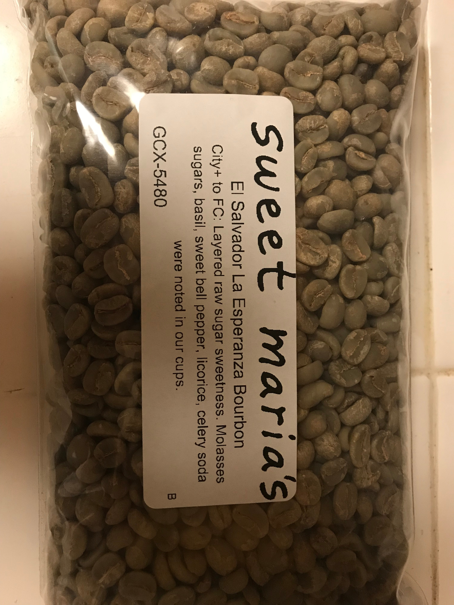
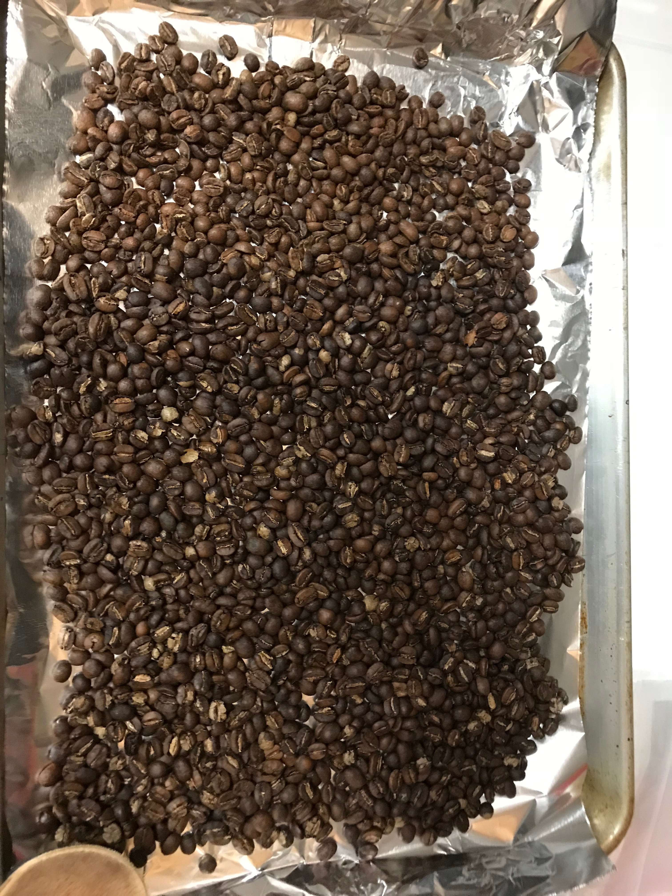

# coffee-roasting
Repository to track coffee roasting recipes and results

# Roasts

## January 20, 2018

Recipe:
- 6 minutes, 75% fan, medium temperature
- 4 minutes, 100% fan, high temperature
- 2.5 minutes, 75% fan, medium temperature
- 1.0 minutes, cooldown

| Batch | Crack 1 | Crack 2|
|-------|---------|--------|
| 100g  |  3.4    | 1.7    |
| 100g  |  2.2    | 1.5    |
| 100g  |  3.3    | 2.4    |
| 100g  |  3.1    | 1.2    |

