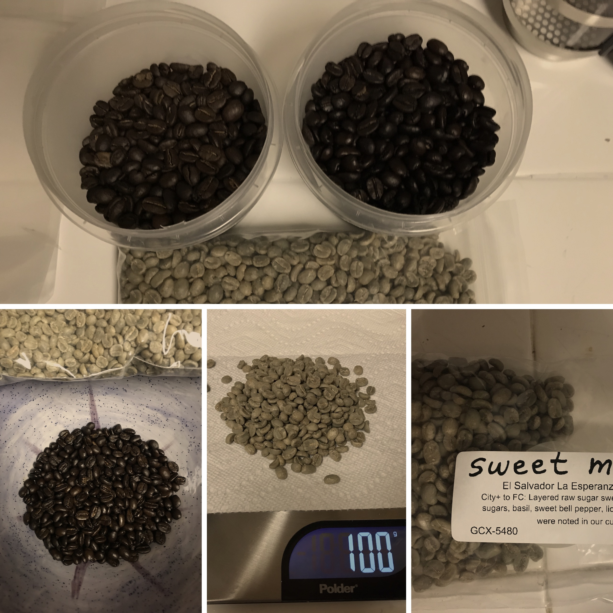

# coffee-roasting
Repository to track coffee roasting recipes and results

# Equipment

I use a [FreshRoast SR500 Automatic Coffee Bean Roaster](https://www.amazon.com/dp/B0034D9ONO/ref=asc_df_B0034D9ONO5348698/?tag=hyprod-20&creative=395033&creativeASIN=B0034D9ONO&linkCode=df0&hvadid=167144008776&hvpos=1o2&hvnetw=g&hvrand=14847226254375304383&hvpone=&hvptwo=&hvqmt=&hvdev=c&hvdvcmdl=&hvlocint=&hvlocphy=9032135&hvtargid=pla-316095657737) to roast at home. It's a fairly simple device that offers three roasting controls: time, fan speed, and temperature. Sadly, temperature controls do not indicate temperatures inside the roasting chamber. That means guaging the roast is a matter of (1) monitoring rates at which beans darken, (2) controlling how quickly they turn over inside the chamber, and (3) listening for first and second crack. 

# Roasts

## January 20, 2018

Recipe:
- 6 minutes, 75% fan, medium temperature
- 4 minutes, 100% fan, high temperature
- 2.5 minutes, 75% fan, medium temperature
- 1.0 minutes, cooldown

| Batch | Crack 1 | Crack 2|
|-------|---------|--------|
| 100g  |  3.4    | 1.7    |
| 100g  |  2.2    | 1.5    |
| 100g  |  3.3    | 2.4    |
| 100g  |  3.1    | 1.2    |

## January 28, 2018

I abandoned the recipe approach in favor of simply watching the beans and listening for first and second crack. I started each batch with 100% fan speed and high temperature. I turned fan speed to 50% upon first crack. Cooldown commenced shortly after second crack, with fan speeds back to 100%. 

| Batch | Crack 1 | Crack 2| Color (1/6) | 
|-------|---------|--------|-------------|
| 130g  |  4.0    | 5.9    |  4.5 |
| 120g  |  3.5    | 5.2    |  3.5 |

